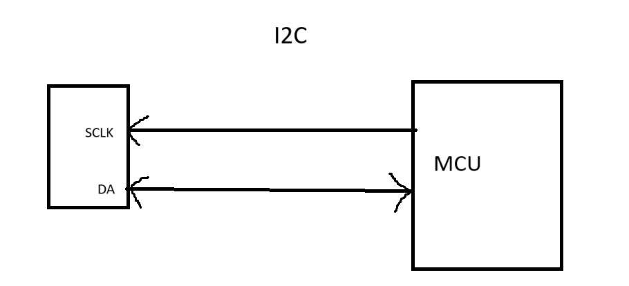
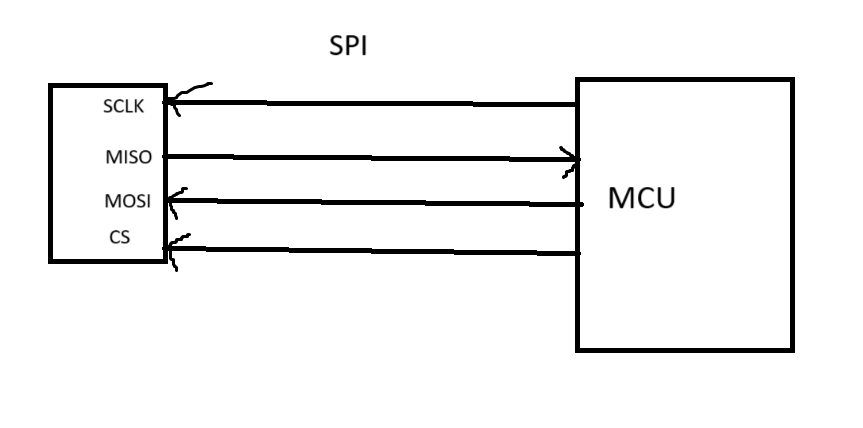

# How to choose the right ADC
- Input range(V) - the max is around 5V
- Resolution - the number of bits
- SPS.Speed - samples per second - sampling rate 10K - 3.6G
    - скорост на сигнала - 0.7 * скоростта на светлината
- Communication/Interface - SPI, I2C, UART

SPI may use daysi chain

- Footprint - the size of the chip
- Grade - the environment it can work with 
- Price - the most important factor

# Какво е сензор
- Сензор - устройство, което преобразува физическа величина и я записва, индикира, или реагра на нея
- Видове - аналогови и цифрови/ активни(въздействат върху околната среда ултразвуков, ) и пасивни

за теста - имаме сензор и му се подава напирмиер 30 градуса и той трябва да измери тази температура и да кажем какво ще има на изхода - двоично и шеснайетично