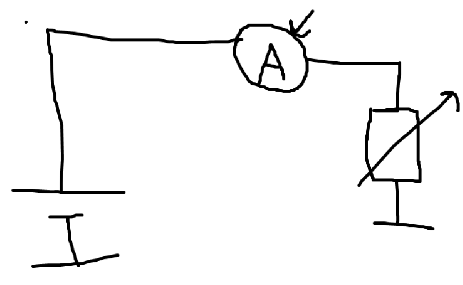
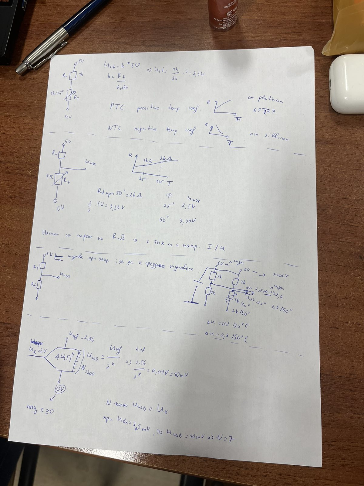
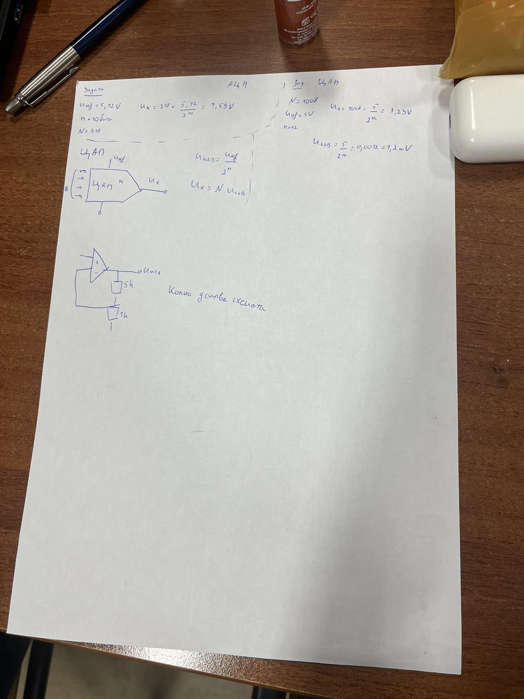

- Микрофоните се представят като променливи кондензатори
- Температура се измерва с променлив резистор, защото като се увеличи температурата на проводника, заради по-голямата амплитуда на движещите се частици в него, се увеличава и съпротивлението му

- как се мери съпротивление ппц

Сензори за мерене на натиск - тензорезистори, означават се като променливи резистори и буквата P
Сензори за мерене на температура - термистори, означават се като променливи резистори и буквата Т

АЦП - схема, която мери напрежение

Параметри:
- опорно напрежение Uref
- n - разрядност в битове

