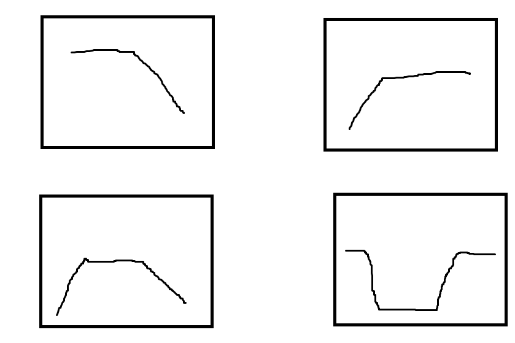
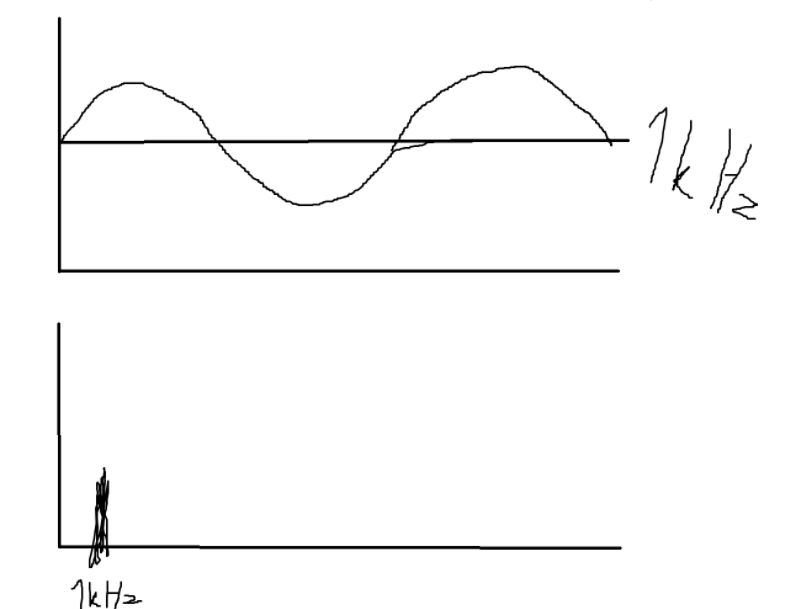
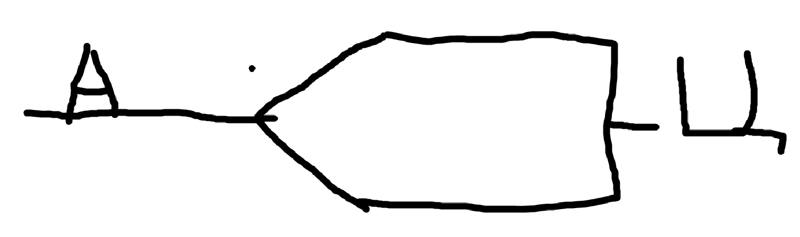
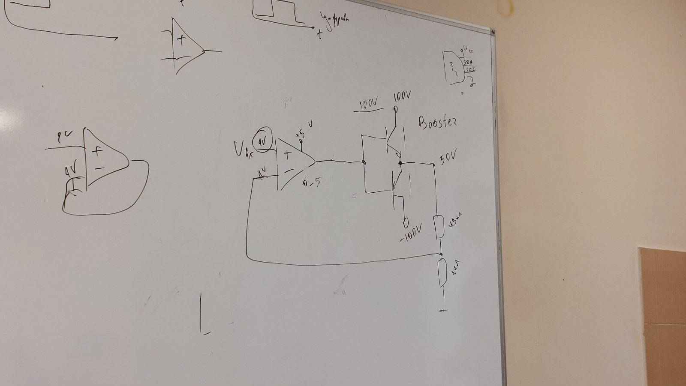
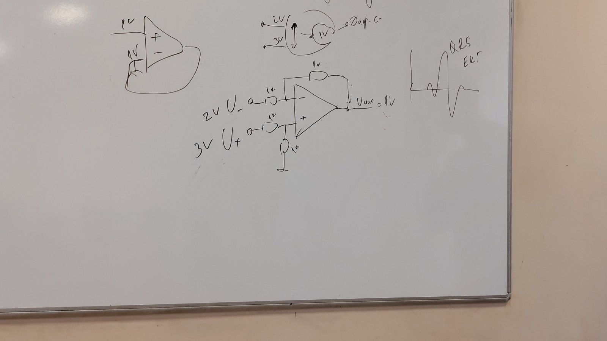
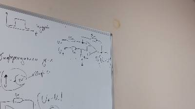
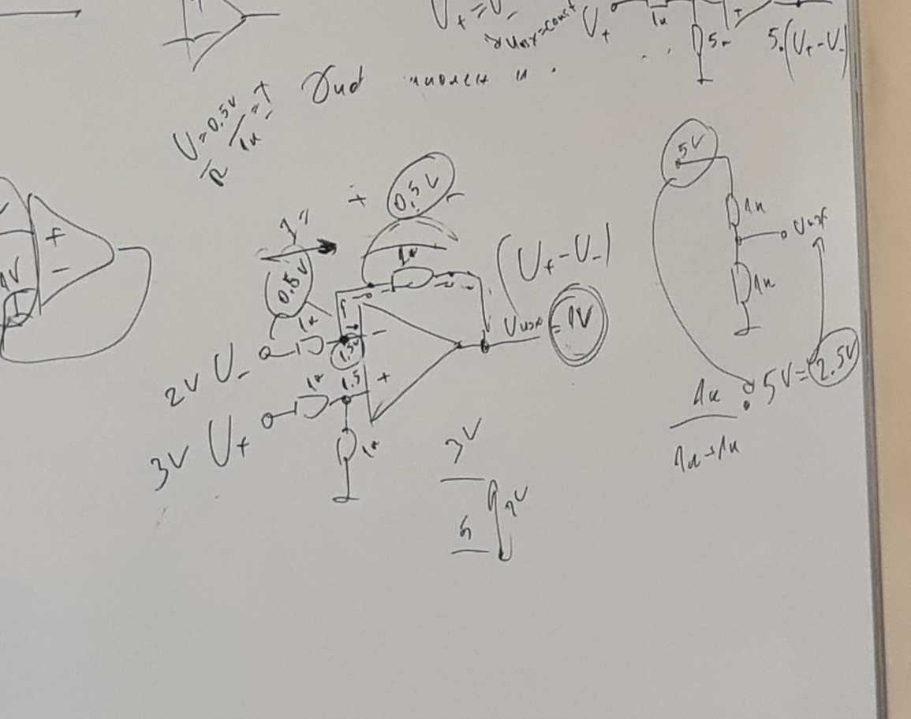

# Системи за измерване на данни

В природата нещата се изменят постепенно, затова се използват аналогови сензори

## Обработка на сигнали
- сензорите имат малкър размах, малка измяна в напрежението и затова се използват усилватели.

- идеалния усилвател прави просто сигнала с по-голяма амплитуда и нищо друго

- усилвател -> филтър -> АЦП -> CPU
- шумът идва отвсякъде и се наслага на полезния сигнал
- спектрална плътност - колко е голяма амплитудата на шума

## Филтри
()
- трансформация 

### Нискочестотни филтри
### Високочестотни филтри
### Лентови филтри
### Режекторни филтри
да си ги видя

## АЦП

- Понеже няма усилвател за 100V се използва booster

- Дифернциален усилвател - за ЕКГ например

- Дифернциален усилвател с увеличение 5 пъти на разликата

