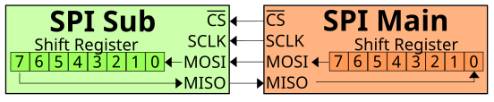
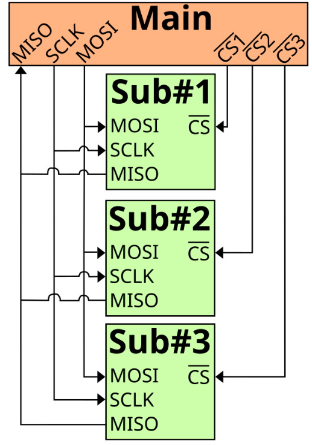
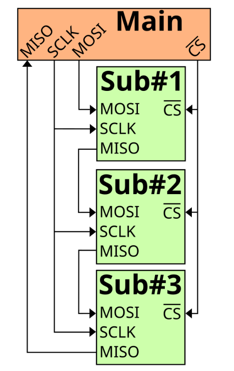
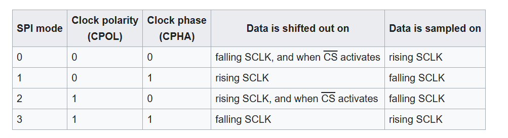
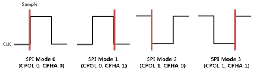
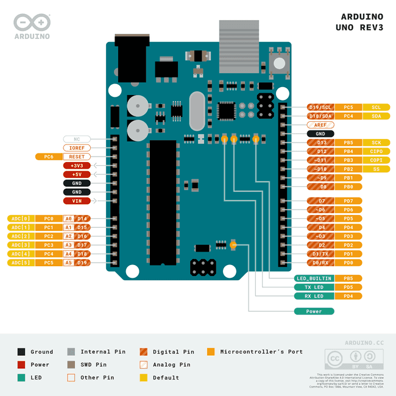

При I2C имаме Адресен дешифратор - 

Serial Perifical Interface
- цифров
- синхронен
- сериен 

като I2C - master slave архитектура

Може да се реализира с много по-малко компоненти на хардуерно ниво


Full duplex - не само можем да пращаме в двете посоки а сме ДЛЪЖНИ да го правим 
ако искаме само да четем и нямаме какво да пишем - пращаме нули но е  задължително да има нещо


Нямаме адресация - един сигнал към всяко отделно устройство който да активира - SS, SE 


4 signals
- CS/SS - индивидуален за всяко подчитено устройство
- SCLK - както при I2C - тактов сигнал
- MOSI - еднопосочен, master output slave input
- MISO - еднопосочен, master input slave output


Има няколко схеми на свързване

Входния сигнал отива в единия край на shift register, а другия край - отива на изхода
 


Начин на свързване - едноименните сигнали си се свързват както са. Ползва се главно за памети (може и Quad spi). Това е ако е за едно към едно.
ППЦ се ползва за кратки разстояния (като I2C), но е по-бърз като скростта се задава от master-a с тактовата честота



Това е при няколко подчинени устройства 


втори начин:


Това се ползва главно като са еднакви устройствата и го правим ако datasheet-a го казва изрично че го поддържа. Логиката е подобна на тази за светодиодните ленти 

Като го Init-ваме имаме няколко настройки за задаване:


1. поляритет на сигнала - дали е инвертиран или не
2. фаза на тактовия сигнал - при кой фронт четем данните



По подразбиране имаме CS - разбираме го от pinout диаграмата, където пише SS
 
10ти по подразбиране и ако ни трябват още може да си добавим


Bit rate и baud rate-а съвпадат, (защото е 0 и 1)
MSB (most significant bit)

```SPI.beginTransaction(SPISettings(14000000, MSBFIRST, SPI_MODE0));```

Ръчно трябва да го активираме:
digitalWrite(CS_PIN, LOW);  //HIGH ако е неинвертирано
И така пишем/четем
- receivedVal = SPI.transfer(val)
- receivedVal16 = SPI.transfer16(val16) # същото ма за uint_16
- SPI.transfer(buffer, size) - праща един байт и пише на същия
digitalWrite(CS_PIN, HIGH); //правим го неактивен
SPI.endTransaction()

горе долу вс го има тука - https://docs.arduino.cc/language-reference/en/functions/communication/SPI/