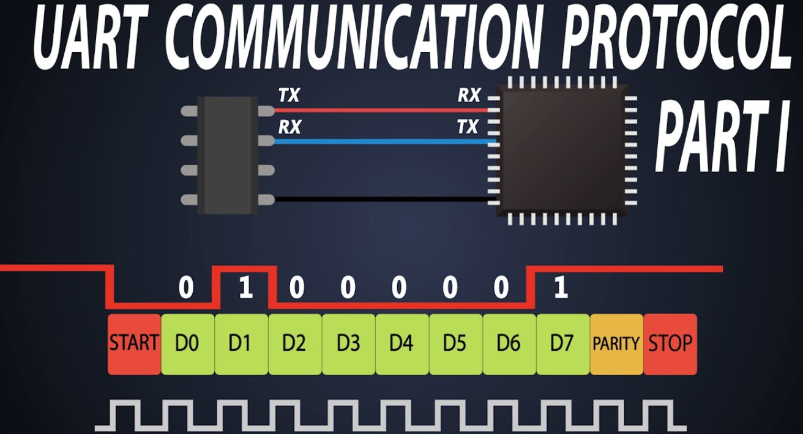

# Interface - технология за връзка между 2 машини

## подвидов 1
- паралелни - много проводници и паралелно се пращат по няколко бита (DDR за RAM, където най-късата писта е най-бърза, затова са назъбени пистите и само тък се срещат високи честоти)
- серийни - битове 1 по 1 в 1 проводник
- хибридни - сноп от серийни интерфейса, които въпреки че имат малка разлика в закъснението, просто се разпределя пакета и се запазва в буфер на крайното устройство(USB & PCI express, HDMI, Thunderbolt)

## подвидов 2
- синхронни - има часовник, който синхронизира двата устройства
- асинхронни - няма часовник, а се използва стартов и стопов бит. В UART се разбират в началото на каква честота ще е всичко и после само я спазваме на 2те устройства

## подвидов 3
- peer to peer 
- master - slave

## подвидов 4
- full duplex - едновременно изпраща и получава модерни телефони
- half duplex - може да изпраща или да получава walkie talkie
- simplex - само изпраща или само получава (телевизия)

 

boud rate - скорост на предаване на символи - 2/4/10 бита могат да са 1 символ
bit rate - скорост на предаване на битове
  

Parity bit

# UART - 2ри слой на OSI модела

- Active Low
- Само 2ичен
- пакетите са 8 бита
- При boud rate, защото е само 2ичен, съвпада с bit rate
- RX и TX са винаги обратни
- RS232 - самия интерфейс, един от най-старите; Работи на високо напрежение +15V

