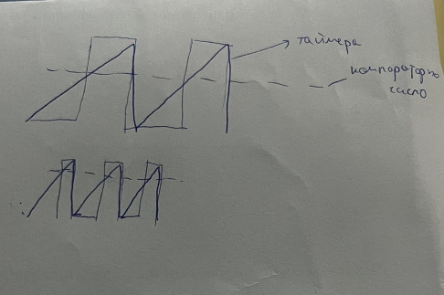
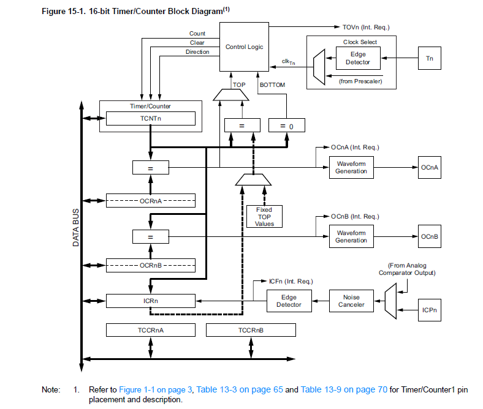
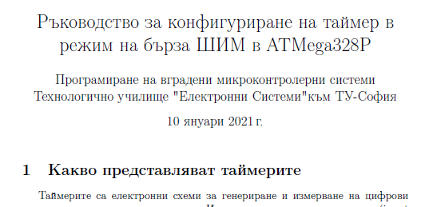
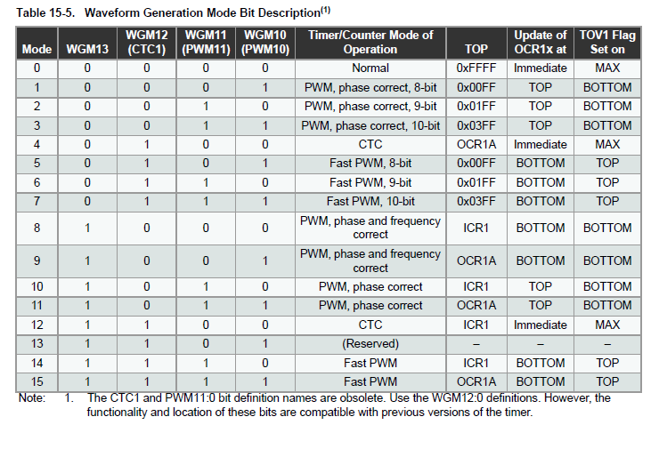
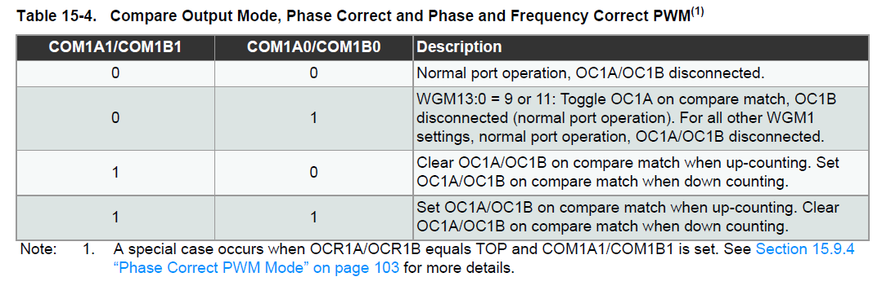
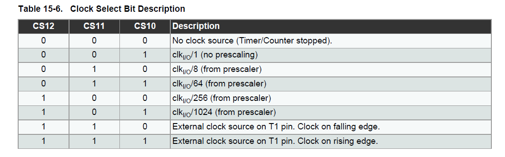
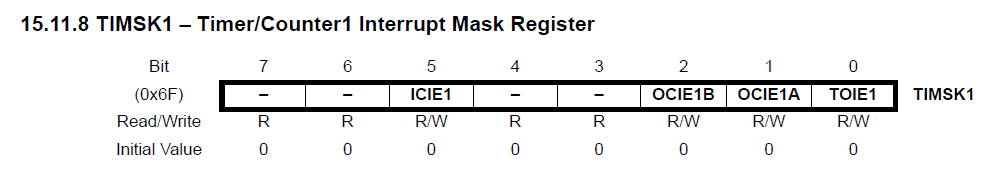

Броячен регистър, който помни един int и определя разрядността на таймера. При всеки пулс на тактовата честота се инкрементира с 1. След overflow се връща на 0

OCnA - може да генерира прекъсвания
блока с = - сравнител
OCRnA - output capture register- регистър за сравнение - сравнява се с брояча и е същата разрядност като брояча
Когато се изравнят ORCnA и бряча може да стане: прекъсване
брояча постоянно се сравнява с 0 или макс стойност на регистъра. Макс стойността може да се програмира

Таймерът управлява един пин. Например когато се изравнят брояча и стойността на изходния канал, да се вдигне пин на 1

ICRn input capture register - когато искаме да прочетем кога се е случило нещо мега бързо подаваме високо ниво на този пин и той веднага запеметява времето на брояча, за да не се изпускат импулсите и като копира прави прекъсване, което може да се обработи после. 

Прекъсванията може да са при компаратора или при ресета на брояча

Най долу за конфигурационните регистри

в other files

винаги ще работим с режим 14 - fast pwm

за да замразим таймера преди да го бърничкаме

в examples/timer/10kHz