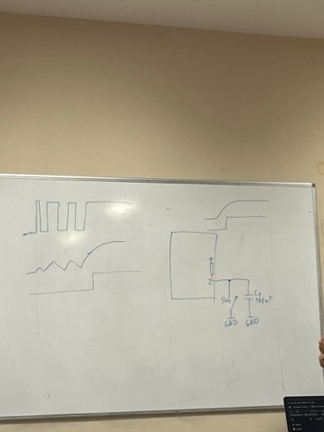

Прекъсвания

Прекъсванията се извършва на хардуерно ниво. Компилаторът си мисли че е умен и иска да оптимизира кода. Та имаме ситуация, която имаме прекъсване, компилатора НЕ я вижда и тази променлива не се променя въпреки че в рамките на прекъсването я променяме.
Това се оправя с:

volatile - казва на компилатора да не оптимизира паметта

Прекъсванията се извършват в привилигирован режим.

Как се сменят нижки на едно ядро

syscalls

Прекъсвания:

1.  Digital pin 2, 3 - дебаунсинг на бутон

volatile uint8_t lastButtonState = 0;
volatile unint8_t * volatile buttonState = &lastButtonState;

Слага се и на двете места, за да може хем самия указател да е volatile, хем да сочи към volatile променлива.