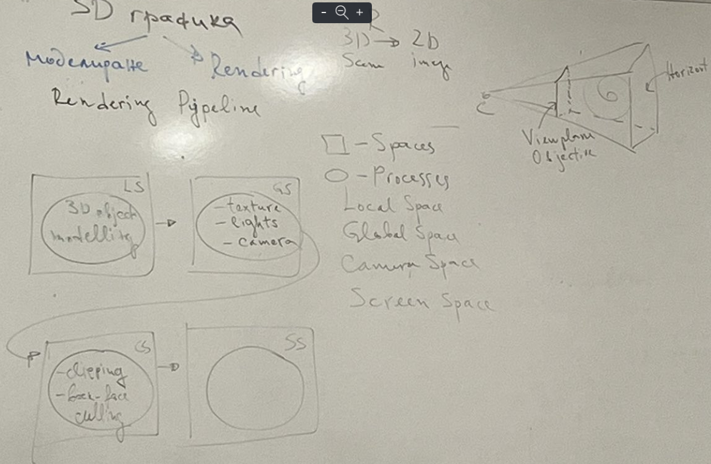
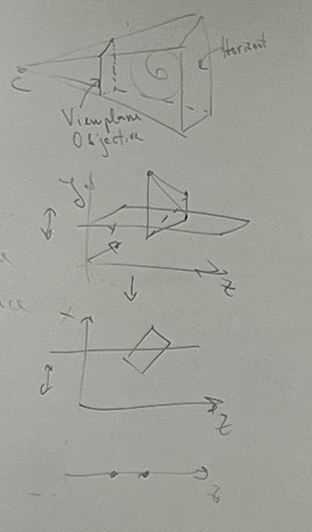

Renderring pipeline

renderring transforms a 3d scene into a 2d image

4 spaces with processes

Local space:
- 3D object
- modelling

Global space:
- texture
- lights
- camera

Camera space:
- clipping - всичко, което не е в обсега на камерата се отрязва
- backface culling - всичко, което е обърнато обратно от камерата се отрязва

Screen space:
- rasterization
- z-buffer
- shading
- ray tracing
- radiosity - осветяване на повърхнини

