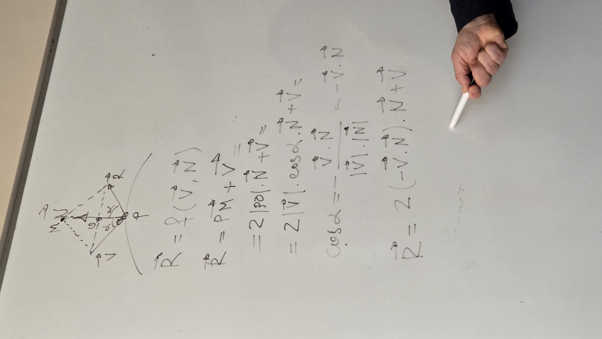
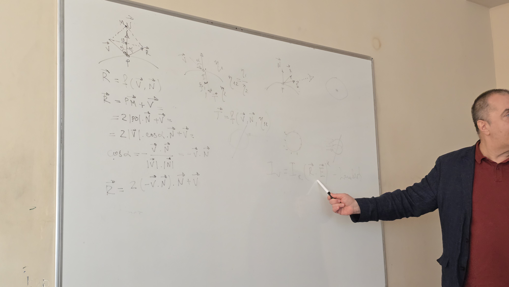

# Renderring and ray tracing

Ray tracing  - метод на лъчево трасиране, което е част от renderring. 
Има различни видове модели за създаване на 3D обекти
При renderring се използва полигонален модел. Нормала към тригъгълника и върховете. 
Renderring-a минава през 3 пространства. Local, global, camera, screen. 
Тази последователност от пространства се нарича renderring pipeline.
Оцветяването(shading) е 2 типа - ray tracing и radiosity(по-груб ,но по-бърз)
Backward ray tracing - тъеесим цвета на лъчите, които стигат до камерата. Те определят снимката на тримерната сцена. 
Отразени и пропуснати лъчи.
За да не се върви безкрайно реверсивно се прави лъчево дърво, което си има дълбочина. На определена бълбочина се спира, като на последното ниво се гледат само лъчите от светлинните източници. 
При ray tracing има два казуса: намиране на пресечна точка между лъч и обект и намиране на посоката и интензитена на отразения и пропуснатия лъч. 
Показва как се намира посоката на отразения и пречупен лъч с нормала. 
Показва интензитетът, който се определя от ъгъла на падане на светлината