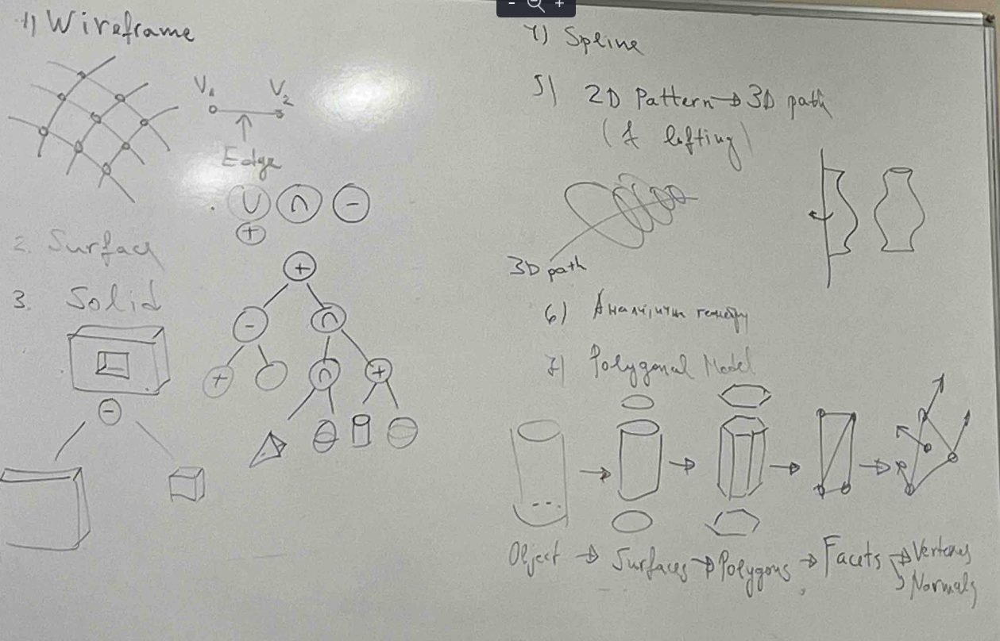

1. Local space:
    - 3D object
    - modelling

2. Global space:
    - texture
    - lights
    - camera

3. Camera space:
    - clipping - всичко, което не е в обсега на камерата се отрязва
    - backface culling - всичко, което е обърнато обратно от камерата се отрязва

4. Screen space:
    - rasterization
    - z-buffer
    - shading
    - ray tracing
    - radiosity - осветяване на повърхнини

Пример за нелинеен филтър:
Изображението се разделя на области. Смята се дисперсията на цвета. Ако е по-голяма от някаква зададена стойност, отново тази облассе разделя и т.н.
